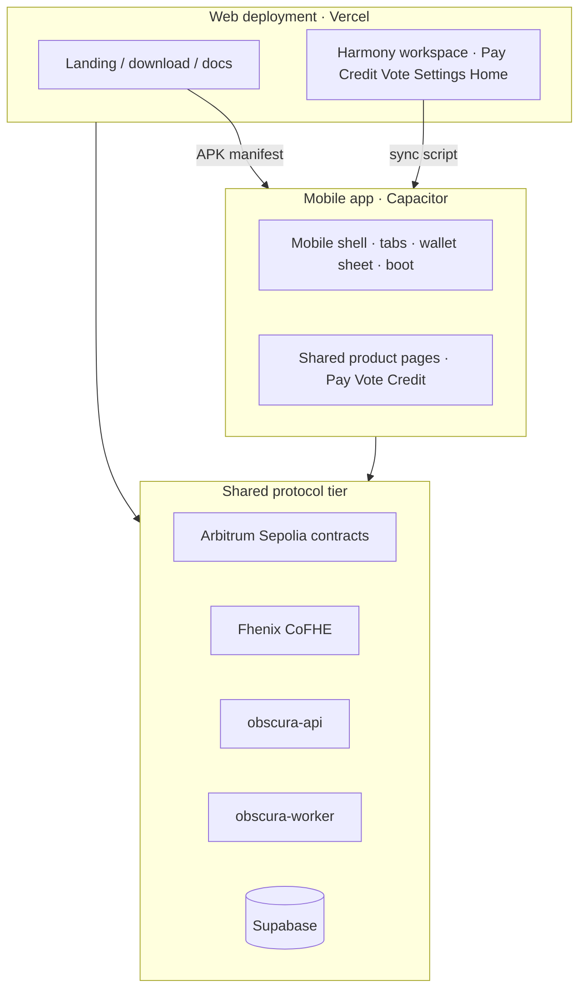
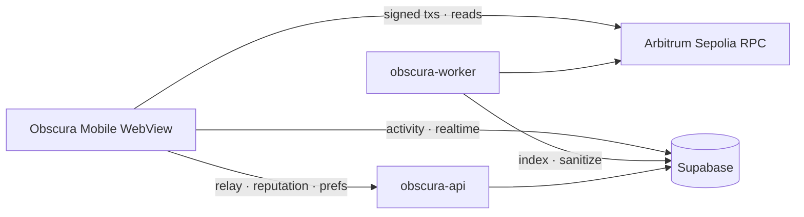

# Obscura Mobile App Architecture Reference (v1)

> **Document type:** Canonical Mobile Client Architecture Reference  
> **Status:** CANONICAL · LIVE (Android sideload + CI builds)  
> **Version:** v1.0  
> **Network:** Arbitrum Sepolia · chainId `421614`  
> **Cut date:** 2026-05-30  
> **Audience:** Engineers · Auditors · QA · Ecosystem partners · Store reviewers  
>
> **Companion document:** [OBSCURA_PROTOCOL_ARCHITECTURE_v1.md](OBSCURA_PROTOCOL_ARCHITECTURE_v1.md) — ecosystem, contracts, FHE, backend, SDK, MCP  
> **Mobile source repo:** `obscura-mobile` (Capacitor shell; fork of shared web product code)  
> **Web source of truth:** `frontend/obscura-os-main/` in this monorepo  
> **Distribution:** [obscuraos.online/download](https://obscuraos.online/download) · `public/downloads/mobile-releases.json`

This document is the **single canonical architecture reference** for the Obscura **mobile client**. It describes how the Android app delivers Pay, Vote, and Credit on device, how it connects to the same encrypted protocol stack as the web Harmony workspace, and how FHE privacy guarantees apply in a Capacitor WebView context.

**Developer portal:** `/docs/mobile` on the production frontend · **Protocol ecosystem:** [OBSCURA_PROTOCOL_ARCHITECTURE_v1.md](OBSCURA_PROTOCOL_ARCHITECTURE_v1.md) (§40)

---

## Document Conventions

| Symbol | Meaning |
|---|---|
| 🟢 **ACTIVE** | Shipped in current mobile build (`0.1.0+`) |
| 📱 **MOBILE-ONLY** | Exists only in the mobile shell, not the marketing web site |
| 🔐 **ENCRYPTED** | FHE ciphertext handles; plaintext never on-chain except explicit reveal |
| 🛡️ **REVEAL-ON-DEMAND** | User must tap Reveal; no auto-decrypt on mount |
| 🌐 **PUBLIC** | Plaintext by design (metadata, aggregates after finalize) |
| ⚡ **TWO-STEP** | CoFHE pattern: chained txs (e.g. Credit transfer + record) |

Cross-references to the ecosystem doc use `(§N)` pointing to [OBSCURA_PROTOCOL_ARCHITECTURE_v1.md](OBSCURA_PROTOCOL_ARCHITECTURE_v1.md).

---

## Table of Contents

1. [Executive Summary](#1-executive-summary)
2. [Mobile vs Web Boundary](#2-mobile-vs-web-boundary)
3. [Product Scope on Mobile](#3-product-scope-on-mobile)
4. [Mobile Shell Architecture](#4-mobile-shell-architecture)
5. [Navigation & Information Architecture](#5-navigation--information-architecture)
6. [FHE & Privacy on Mobile](#6-fhe--privacy-on-mobile)
7. [Wallet, Chain & Account Model](#7-wallet-chain--account-model)
8. [Shared Backend Integration](#8-shared-backend-integration)
9. [End-to-End Data Flows](#9-end-to-end-data-flows)
10. [Sync Model from Web](#10-sync-model-from-web)
11. [Configuration & Environment](#11-configuration--environment)
12. [Build, Release & Distribution](#12-build-release--distribution)
13. [Security Model](#13-security-model)
14. [SDK, MCP & Integrator Stack](#14-sdk-mcp--integrator-stack)
15. [Operational Checklist](#15-operational-checklist)

---

## 1. Executive Summary

Obscura Mobile is a **native Android client** (Capacitor 8) that wraps the same React product codebase used by the Harmony web workspace. It delivers three encrypted finance modules in one install:

| Module | Route | Core capability |
|---|---|---|
| **Pay** | `/pay` | Shield USDC → ocUSDC, stealth inbox, streams, escrows, public-mode passkey USDC |
| **Vote** | `/vote` | FHE-encrypted ballots, delegation, treasury, rewards, advanced governor |
| **Credit** | `/credit` | Encrypted lending positions against canonical `ocUSDC_Pay` |

The mobile app is **not** the marketing website. Landing pages, developer portal, and ecosystem storytelling remain on the web deployment (`frontend/obscura-os-main`). Mobile opens directly into `/pay` and uses a bottom-tab shell optimized for thumb navigation and safe areas.

**Privacy model:** Identical to web — Fhenix CoFHE encrypts sensitive amounts and vote choices client-side; encrypted handles live on Arbitrum Sepolia; decryption requires an explicit user action (Reveal or submit flow). See ecosystem doc (§4, §17, §18).

**Current release:** `0.1.0` Android APK (direct sideload). Package ID: `finance.obscura.mobile`.

---

## 2. Mobile vs Web Boundary



| Surface | Web | Mobile |
|---|---|---|
| Marketing landing | ✅ `/` | ❌ Not bundled |
| Developer docs `/docs` | ✅ | ❌ |
| Download page `/download` | ✅ Hosts APK manifest | ❌ (user installs from web) |
| Pay / Credit / Govern workspaces | ✅ Desktop sidebar | ✅ Bottom tabs + sticky sub-nav |
| WalletConnect | Header chip | Bottom sheet (native-first) |
| Service worker push | ✅ Browser | ❌ Disabled on native platform |
| CoFHE encryption | `@fhenixprotocol/cofhe-sdk` | Same SDK in WebView |
| Contract addresses | `VITE_*` env | Same env pattern + boot validation |

**Design principle:** One product logic layer, two presentation shells. Mobile preserves shared hooks, ABIs, and pages; it adds Capacitor lifecycle, safe-area layout, and tab navigation.

---

## 3. Product Scope on Mobile

### 3.1 Pay (`/pay`)

🟢 **ACTIVE** — Default entry route after install.

| Capability | Privacy mode | Notes |
|---|---|---|
| Shield / unshield USDC ↔ ocUSDC | Private | Uses `ocUSDC_Pay` `0xEd46…3a53` |
| Unified send (stealth / direct) | Private | EOA-only for FHE writes |
| Public USDC send | Public | Passkey smart account + ERC-4337 relay |
| Streams, escrows, subscriptions, payroll | Private | Handle-transfer V3 patterns |
| Stealth inbox & address book | Private | Explicit unlock; keys in device storage |
| Activity feed | Both | Supabase Realtime + indexed events |
| Settings / contacts | Both | `/pay/settings`, `/pay/contacts` |

**Pay tabs (horizontal sub-nav):** Overview · Pay · Get Paid · Automations · Activity · Settings

**Privacy modes:** Private Mode (encrypted ocUSDC) and Public Mode (visible USDC via smart account). Public Mode hides Automate / Make private actions — same rule as web.

### 3.2 Govern (`/vote`)

🟢 **ACTIVE** — Full governance workspace without marketing chrome.

| Capability | Encryption | Notes |
|---|---|---|
| Browse / vote / create / results | Ballots encrypted | Multi-option FHE votes |
| Delegation | Public mapping | Dedicated Govern tab |
| Voter rewards | Public accrual | Rewards tab |
| Participation profile | Aggregate signals | Reputation tier display |
| Recent governance activity | Sanitized feed | Overview tab |
| Treasury / Governor | Public execution track | Advanced tab |

**Govern tabs (workspace chrome):** Overview · Proposals · Delegation · Treasury · Rewards · Advanced

**Proposal sub-nav:** Browse · Vote · Create · Results

**UX policies (aligned with web):**
- Reveal-on-demand for tally decrypt and self-vote verification
- No vote alerts drawer in header (removed from web IA)
- Forest-green ballot picker; sealed success panel after cast
- Delegation blocks direct voting until removed

### 3.3 Credit (`/credit`)

🟢 **ACTIVE** — Canonical Pay-backed ocUSDC market only by default.

| Capability | Encryption | Notes |
|---|---|---|
| Supply / borrow / repay | Position encrypted | Two-step CoFHE where required |
| Health factor / position view | Encrypted until Reveal | No mount-time decrypt |
| Earn / vaults | Mixed | Legacy markets behind Advanced |
| Liquidations | Public auction metadata | Encrypted bids |
| Risk / market overview | Public aggregates | TVL, utilization |

**Credit tabs:** Overview · Borrow · Position · Earn · Liquidations · Risk (+ settings drawer)

---

## 4. Mobile Shell Architecture

### 4.1 Capacitor stack

| Item | Value |
|---|---|
| Framework | Capacitor 8 |
| App ID | `finance.obscura.mobile` |
| Display name | Obscura |
| Web bundle | Vite build → `dist/` |
| Android scheme | `https` (WebView) |
| Splash | `#EEF3EA` sage — hidden after boot gate |

```mermaid
flowchart TB
  subgraph NATIVE[Native layer]
    ANDROID[Android APK / Gradle]
    CAP[Capacitor plugins]
  end

  subgraph WEBVIEW[WebView bundle · dist/]
    REACT[React 18 + React Router]
    WAGMI[wagmi v3 + viem]
    COFHE[@fhenixprotocol/cofhe-sdk]
    PRODUCTS[PayPage · VotePage · CreditPage]
  end

  ANDROID --> CAP
  CAP --> WEBVIEW
  REACT --> PRODUCTS
  WAGMI --> CHAIN[Arbitrum Sepolia RPC]
  COFHE --> FHE[Fhenix CoFHE coprocessor]
```

### 4.2 Capacitor plugins (native)

| Plugin | Purpose |
|---|---|
| `@capacitor/app` | Android back button → history back or exit |
| `@capacitor/splash-screen` | Branded splash; manual hide after bootstrap |
| `@capacitor/status-bar` | Light style on sage background |
| `@capacitor/keyboard` | `Body` resize mode — forms stay visible |

### 4.3 Boot sequence

📱 **MOBILE-ONLY** — `AppBootstrap.tsx`

```
1. Native splash (Capacitor) — sage #EEF3EA
2. initNativeShell() — status bar, keyboard, back handler
3. checkEnvHealth() — required VITE_* contract addresses
4. Minimum branded loader (~800 ms) — logo + tagline
5. hideNativeSplash()
6. Render app OR EnvSetupScreen if addresses missing
```

If configuration is invalid, the app shows **Configuration needed** with a list of missing env keys instead of failing silently mid-transaction.

### 4.4 Mobile-only source files

| Path | Role |
|---|---|
| `src/lib/platform.ts` | `IS_MOBILE_APP`, Capacitor init, splash hide |
| `src/App.tsx` | Routes, tab bar visibility, default `/` → `/pay` |
| `src/main.tsx` | Adds `mobile-app` class to `<html>` |
| `src/components/mobile/AppBootstrap.tsx` | Boot loader + env gate |
| `src/components/mobile/MobileTabBar.tsx` | Pay · Govern · Credit bottom tabs |
| `src/components/mobile/MobileSubNav.tsx` | Sticky section chips per product |
| `src/components/mobile/MobileWalletSheet.tsx` | WalletConnect bottom drawer |
| `src/components/mobile/EnvSetupScreen.tsx` | Missing env UI |

Shared layout branch: `HarmonyAppShell.tsx` detects mobile and adjusts header / sidebar (no desktop sidebar on phone).

### 4.5 Layout & safe areas

When `html.mobile-app` is set, CSS applies:

- `env(safe-area-inset-*)` padding for notch and home indicator
- Sticky header + sub-nav offsets (`--mobile-header-total`, `--mobile-chrome-top`)
- Content padding above bottom tab bar (`.mobile-app-content`)
- Toasts positioned above tab bar

---

## 5. Navigation & Information Architecture

### 5.1 Primary navigation

```
┌─────────────────────────────────────┐
│  Header · logo · wallet chip        │  sticky + safe-area top
├─────────────────────────────────────┤
│  Sub-nav chips · section tabs       │  sticky below header
├─────────────────────────────────────┤
│                                     │
│  Product content                    │
│                                     │
├─────────────────────────────────────┤
│  Pay  │  Govern  │  Credit          │  bottom tab bar
└─────────────────────────────────────┘
```

| Layer | Behavior |
|---|---|
| Bottom tabs | Switch between `/pay`, `/vote`, `/credit` |
| Sub-nav chips | Switch sections within active product |
| Android back | `history.back()` or exit app at root |
| Route transitions | Short opacity fade (Framer Motion) |

### 5.2 Route map

| Route | Page | Tab bar |
|---|---|---|
| `/` | Redirect → `/pay` | — |
| `/pay` | PayPage | ✅ |
| `/pay/contacts` | ContactsPage | ✅ |
| `/pay/settings`, `/settings` | SettingsPage | ✅ |
| `/vote` | VotePage | ✅ |
| `/credit` | CreditPage | ✅ |
| `*` | NotFound | context-dependent |

**Excluded from mobile v1:** Landing (`/`), Ecosystem marketing, Docs portal, Identity hub as top-level routes.

---

## 6. FHE & Privacy on Mobile

Mobile inherits the ecosystem FHE architecture (protocol doc §4, §17, §18). This section documents **mobile-specific behavior**.

### 6.1 What FHE protects on device

| Data class | On-chain representation | Mobile display default |
|---|---|---|
| ocUSDC balance | `euint64` handle | Masked (`***` / cipher bars) |
| Transfer amounts | `InEuint64` at submit | Encrypted before wallet tx |
| Credit borrow/supply shares | `euint64` | Masked until Reveal |
| Vote choice index | `InEuint64` | Hidden after cast; optional self-verify |
| Vote tallies (pre-finalize) | Encrypted aggregates | Hidden until Decrypt Public Tally |

### 6.2 CoFHE client on mobile

| Component | Implementation |
|---|---|
| Encryption SDK | `@fhenixprotocol/cofhe-sdk` (same as web) |
| Integration wrapper | `src/lib/fhe.ts` |
| Worker | `zkProve.worker` for proof generation |
| WASM | `tfhe_bg.wasm` bundled in Vite assets |

**WebView constraint:** FHE runs entirely in the embedded browser engine. Performance depends on device CPU; proof generation may take longer on mid-range Android hardware. UX uses the shared FHE stepper: `IDLE → ENCRYPTING → COMPUTING → SENDING → SETTLING → READY`.

### 6.3 Reveal-on-demand policy

🛡️ **Mandatory on mobile** — same as web (protocol doc §8.1, §38.13):

- No `decryptForView` in `useEffect` on page mount
- Balance and position tiles show placeholders until user taps **Reveal**
- Vote tally decrypt and self-vote verify are explicit button actions
- `waitForTransactionReceipt` must succeed before `FHEStepStatus.READY`
- CoFHE rate limits show cooldown UX (~30s); RPC 429 uses retry guidance

**User-facing copy:** Never expose `euint`, `ctHash`, `ACL`, or `coprocessor`. Say *encrypted*, *private*, *reveal*.

### 6.4 Dual execution planes

| Plane | Wallet | Asset | FHE writes |
|---|---|---|---|
| **Private** | EOA via WalletConnect | ocUSDC_Pay | ✅ Allowed |
| **Public** | Passkey smart account (ERC-4337) | Circle USDC | ❌ Encrypted inputs rejected (`InvalidSigner`) |

Smart accounts cannot forward `InEuint64` proofs — CoFHE binds encryption to the immediate EOA caller. Mobile enforces the same separation as web.

### 6.5 Residual public metadata (testnet)

Even with FHE, mobile users should understand these remain public (protocol doc §3.2):

- Wallet addresses in events and activity feed
- Transaction timestamps and hashes
- Proposal titles, deadlines, participation counts
- Delegation target addresses
- Shield/unshield bridge amounts (USDC entry/exit wrapper)

---

## 7. Wallet, Chain & Account Model

### 7.1 Chain

| Item | Value |
|---|---|
| Network | Arbitrum Sepolia |
| Chain ID | `421614` |
| Primary env | `VITE_CHAIN_ID=421614` |
| RPC override | `VITE_ARBITRUM_SEPOLIA_RPC` |
| Fallback pool | publicnode, drpc, official Arbitrum, Tenderly (see protocol doc §25.2) |

Wrong-network detection prompts user to switch before writes or decrypts.

### 7.2 Wallet connection (mobile-native)

📱 **MOBILE-ONLY** — `MobileWalletSheet.tsx`

| Context | Connectors |
|---|---|
| Native APK | WalletConnect-first bottom sheet → MetaMask, Rainbow, etc. |
| Browser dev preview | Injected + WalletConnect via wagmi |

Header shows truncated address and network badge. Session chain ID drives wrong-network banners on Pay, Credit, and Govern pages.

### 7.3 Smart account (Pay public mode)

| Feature | Technology |
|---|---|
| Passkey enrollment | WebAuthn / P-256 |
| Account type | ERC-4337 smart account |
| Gas sponsorship | Obscura paymaster via `obscura-api` relay |
| Scope | Public USDC transfers only |

Relay endpoints match web: `/relay`, `/estimate-userop-gas`, `/userop-receipt` on `VITE_RELAY_URL`.

---

## 8. Shared Backend Integration

Mobile uses the **same off-chain services** as the web Harmony workspace (protocol doc §23–§24). No mobile-specific backend fork.



| Service | Env vars | Mobile usage |
|---|---|---|
| **Supabase** | `VITE_SUPABASE_URL`, `VITE_SUPABASE_ANON_KEY` | Activity feed, Realtime inserts |
| **obscura-api** | `VITE_RELAY_URL`, `VITE_NOTIFICATIONS_URL` | UserOp relay, reputation GET, notification prefs |
| **obscura-worker** | (indirect) | Indexes chain events → activity + reputation |
| **CoFHE** | (SDK) | Encrypt/decrypt permits |

**Push notifications:** Service worker registration is **skipped on native platform** (`main.tsx`). Mobile v1 does not ship native FCM push; activity is pull/poll + in-app feed.

**Reputation:** `GET /reputation/:wallet` returns capped tier summary — no decrypted amounts.

---

## 9. End-to-End Data Flows

### 9.1 Private Pay send (mobile)

| Step | Actor | Data |
|---|---|---|
| 1 | User | Enter amount + recipient in UnifiedSendForm |
| 2 | CoFHE SDK | `encryptAmount` → `InEuint64` |
| 3 | Wallet | Sign `confidentialTransfer` tx |
| 4 | Chain | Update encrypted balances (`euint64`) |
| 5 | Worker | Index paired event → sanitized activity row |
| 6 | Supabase | Realtime INSERT → Activity tab |
| 7 | UI | Masked balance until Reveal |

### 9.2 Encrypted vote cast (mobile)

| Step | Actor | Data |
|---|---|---|
| 1 | User | Select option in forest-green ballot picker |
| 2 | CoFHE SDK | Encrypt option index |
| 3 | Wallet | Sign `castVote(proposalId, InEuint64)` |
| 4 | Chain | Homomorphic tally update; `VoteCast` event (no option in ABI args) |
| 5 | Worker | Reputation signal `vote_participated` |
| 6 | UI | Sealed success panel; optional Show my vote |

### 9.3 Credit borrow (mobile)

| Step | Actor | Data |
|---|---|---|
| 1 | User | Enter borrow amount on Position / Borrow tab |
| 2 | CoFHE SDK | Encrypt amount |
| 3 | Wallet | Two-step: `confidentialTransfer` + `borrow` (⚡ TWO-STEP) |
| 4 | Chain | Encrypted debt shares updated |
| 5 | UI | HealthRibbon + masked position until Reveal |

Full atlas: protocol doc §20.

---

## 10. Sync Model from Web

The mobile repo is a **Capacitor fork** of `frontend/obscura-os-main`. Product logic syncs from web; mobile shell files are preserved.

```
OBSCURA-main/frontend/obscura-os-main/     ← source of truth (shared UI + hooks)
         │
         │  scripts/sync-from-obscura-web.ps1
         ▼
obscura-mobile/                            ← Capacitor shell + mobile-only files
         │
         │  npm run build → npx cap sync
         ▼
android/                                   ← Gradle APK / AAB output
```

### 10.1 Synced directories

`src/components/*` (except mobile), `src/pages/*`, `src/hooks/*`, `src/config/*`, `src/abis/*`, `src/contexts/*`, `src/lib/*` (except `platform.ts`), tests.

### 10.2 Preserved on sync (never overwritten)

| File / directory | Reason |
|---|---|
| `src/App.tsx` | Mobile routes + tab bar |
| `src/main.tsx` | `mobile-app` class; no SW on native |
| `src/lib/platform.ts` | Capacitor lifecycle |
| `src/components/mobile/*` | Shell components |
| Mobile CSS blocks in `index.css` | Safe areas, tab bar |
| `capacitor.config.ts` | Native IDs |
| `android/`, `ios/` | Native projects |

**Post-sync checklist:** Run `npm run test`, `npm run cap:sync`, device QA on Pay shield, vote cast, credit borrow.

---

## 11. Configuration & Environment

### 11.1 Required boot variables

Validated at startup via `src/lib/envHealth.ts`. Minimum set includes core Pay, Vote, and stealth contract addresses. Full production list: `config/mobile.production.env` in the mobile repo.

**Canonical asset address (Pay + Credit):**

```
VITE_OBSCURA_PAY_OCUSDC_ADDRESS=0xEd46020Df8abe7BB1E096f27d089F4326D223a53
```

**Vote anchor:**

```
VITE_OBSCURA_VOTE_ADDRESS=0xe358776AfdbA95d7c9F040e6ef1f5A021aF91730
```

Complete registry: protocol doc §32 + `contracts-hardhat/deployments/arb-sepolia.json`.

### 11.2 Local development

```bash
cd obscura-mobile
npm install
cp .env.example .env          # or config/mobile.production.env
npm run dev                   # browser preview at :8080
npm run cap:sync              # build + copy to android/
npm run cap:android           # open Android Studio
```

### 11.3 CI production env

GitHub Actions copies `config/mobile.production.env` → `.env.production` before build so release APKs ship with working addresses without manual secret injection for on-chain config.

---

## 12. Build, Release & Distribution

### 12.1 Artifacts

| Artifact | Use |
|---|---|
| `app-debug.apk` | Side-load QA |
| `app-release.apk` | Signed direct install |
| `app-release.aab` | Google Play Console |

### 12.2 Web-hosted sideload (monorepo)

The web app hosts a release manifest for direct download:

| File | Purpose |
|---|---|
| `public/downloads/mobile-releases.json` | Version, SHA-256, install steps |
| `public/downloads/obscura-mobile-0.1.0.apk` | Binary (gitignored; deployed to CDN) |
| `/download` route | `MobileDownloadPage.tsx` |

Manifest fields: `version`, `publishedAt`, `downloadPath`, `sizeBytes`, `sha256`, `minAndroid`, `notes`.

### 12.3 Versioning

| Field | Source |
|---|---|
| `versionName` | Semver e.g. `0.1.0` |
| `versionCode` | CI run number (monotonic for Play Store) |
| Manifest `latestVersion` | Must match shipped APK |

### 12.4 Store readiness

Before Play Store submission:

- Device QA checklist (`DEVICE_QA.md` in mobile repo)
- Release keystore + GitHub signing secrets
- Privacy policy URL (web `/privacy`)
- Testnet disclaimer in store listing (Arbitrum Sepolia)

---

## 13. Security Model

### 13.1 On-device

| Control | Implementation |
|---|---|
| Stealth keys | Generated client-side; encrypted local persistence |
| Contact labels | localStorage only — never uploaded |
| Env secrets | No private keys in repo; only public contract addresses + Supabase anon key |
| WebView | Capacitor `https` scheme; no arbitrary URL loading |
| Clipboard | Wallet address copy — user initiated only |

### 13.2 Network & backend

| Control | Implementation |
|---|---|
| TLS | HTTPS for API, Supabase, RPC |
| CORS | API allows configured origins; mobile WebView origin must be allowlisted for relay if restricted |
| Supabase RLS | Anon key scoped; service role never in client |
| Activity sanitization | Worker strips sensitive Governor args and vote options before DB insert |

### 13.3 FHE-specific

| Threat | Mitigation |
|---|---|
| Auto-decrypt spam | Policy: no mount-time permits |
| Smart account + FHE | Explicit rejection of encrypted writes via AA |
| Wrong chain | Session chain verification before decrypt/write |
| Rate limits | CoFHE + RPC cooldown UX |

Trust assumptions match protocol doc §19.4.

---

## 14. SDK, MCP & Integrator Stack

The mobile app is a **consumer** of the Obscura protocol, not an alternative SDK surface.

| Layer | Package / service | Mobile role |
|---|---|---|
| In-app FHE | `@fhenixprotocol/cofhe-sdk` | Encrypt/decrypt inside WebView |
| Integrator SDK | `@obscura-fhe/sdk` | **Not bundled in APK** — for Node/automation/external apps |
| MCP v1 | Obscura agent server | **Not in mobile UI** — wallet-scoped tools for AI agents |
| Developer docs | Web `/docs` | SDK onboarding, MCP reference |

**Relationship:**

```mermaid
flowchart LR
  MOBILE[Obscura Mobile APK]
  WEB[Harmony Web App]
  SDK[@obscura-fhe/sdk]
  MCP[Obscura MCP v1]
  CHAIN[Contracts + CoFHE]

  MOBILE -->|cofhe-sdk + wagmi| CHAIN
  WEB -->|cofhe-sdk + wagmi| CHAIN
  SDK -->|viem builders| CHAIN
  MCP -->|SDK + API reads| CHAIN
```

Integrators building automation should use `@obscura-fhe/sdk` and MCP — not reverse-engineer the APK WebView. Module mapping: protocol doc §39.

---

## 15. Operational Checklist

### 15.1 Pre-release device QA

- [ ] Cold boot → splash → branded loader → `/pay`
- [ ] WalletConnect connect + Arbitrum Sepolia switch
- [ ] Pay: shield USDC → ocUSDC → masked balance → Reveal
- [ ] Pay: private send + activity feed row
- [ ] Govern: cast encrypted vote → sealed panel
- [ ] Govern: Delegation tab set/clear delegate
- [ ] Credit: borrow two-step flow + health ribbon
- [ ] Android back button navigation + exit at root
- [ ] Keyboard does not cover submit buttons
- [ ] Env setup screen appears when addresses missing

### 15.2 After web sync

- [ ] `npm run test` (vote regression suites)
- [ ] Diff preserved mobile files
- [ ] `npm run cap:sync`
- [ ] Bump `mobile-releases.json` if shipping new APK
- [ ] Update SHA-256 in manifest

### 15.3 Related documents

| Document | Contents |
|---|---|
| [OBSCURA_PROTOCOL_ARCHITECTURE_v1.md](OBSCURA_PROTOCOL_ARCHITECTURE_v1.md) | Full ecosystem, contracts, FHE, backend, SDK, MCP |
| `obscura-mobile/README.md` | Quick start |
| `obscura-mobile/DOCS.md` | Operational mobile repo reference |
| `obscura-mobile/DEVICE_QA.md` | Device test checklist |
| `frontend/obscura-os-main/public/downloads/mobile-releases.json` | Sideload manifest |

---

## Revision History

| Version | Date | Notes |
|---|---|---|
| v1.0 | 2026-05-30 | Initial canonical mobile architecture reference aligned with protocol doc v1.2 and Govern IA restructure |

---

*Obscura Mobile — Private money, computed in the open. Same encrypted protocol as web. Built for Arbitrum Sepolia testnet.*
